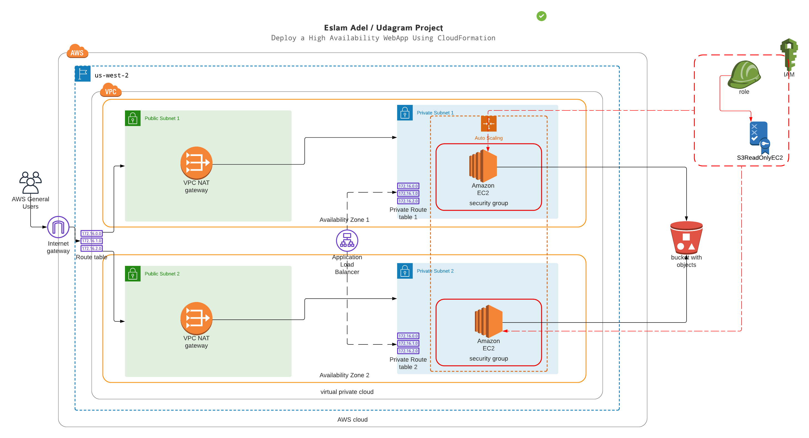
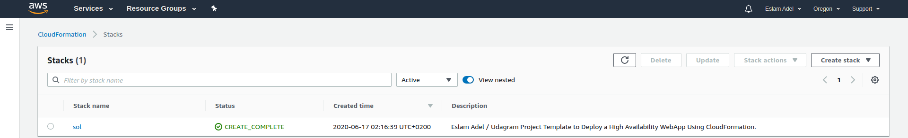

# Deploy a high-availability web app using CloudFormation.
 Deploying web servers for a highly available web app using Cloud Formation, write the code that creates and deploys the infrastructure from the ground up, begin with deploying the networking components, followed by servers, security roles and software.

---
## Diagram

---
## Output

---
## Use
    ./create-update-stack.sh
---
## Credits
- [Lucid Chart](https://app.lucidchart.com)
- [Udacity](https://udacity.com)
